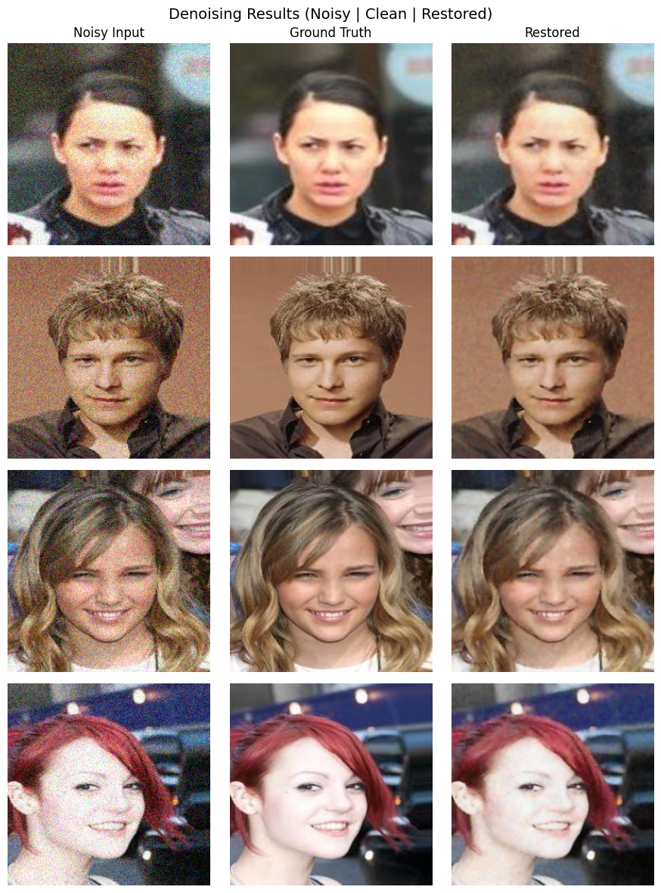
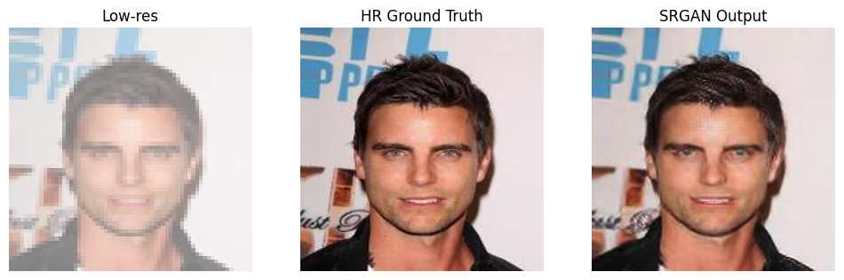
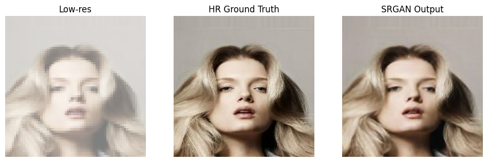
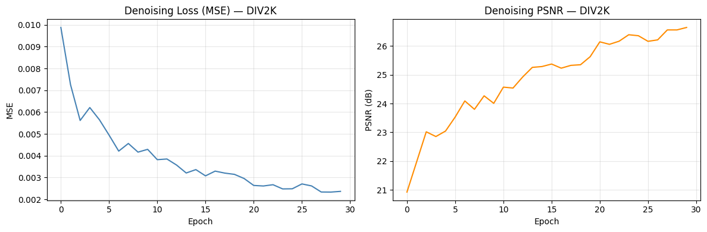
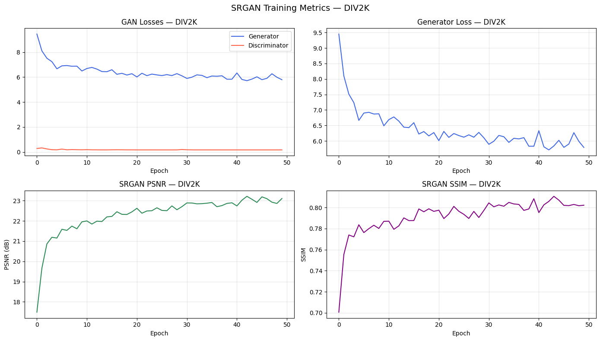
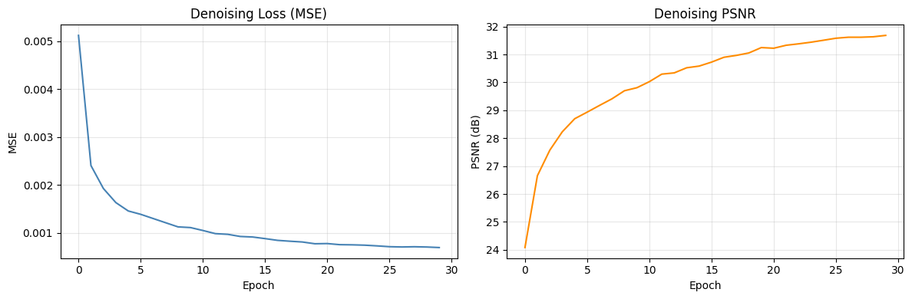
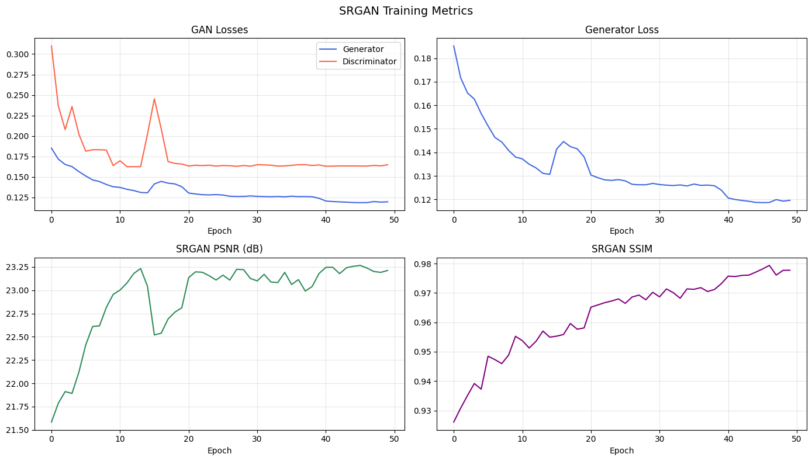

# Image Restoration and Super-Resolution with CNN Denoising + SRGAN

> A PyTorch image-restoration pipeline that removes Gaussian noise with a U-Net style denoising autoencoder, then reconstructs 4x high-resolution images using SRGAN.


## Overview

This project explores a two-stage image restoration workflow:

1. **Denoising:** A CNN U-Net style autoencoder removes Gaussian noise from degraded RGB images.
2. **Super-resolution:** An SRGAN generator upsamples the cleaned 64 x 64 low-resolution image into a 256 x 256 high-resolution output.

The experiments are implemented in two Jupyter notebooks:

| Notebook | Dataset | Purpose |
|---|---:|---|
| `notebook_DIV2K.ipynb` | 800 DIV2K images | Natural-scene image restoration and 4x super-resolution |
| `image_restoration_CelebA.ipynb` | 5,000 CelebA images | Face-image restoration and 4x super-resolution |

## Pipeline

```text
Noisy LR image -> Denoising Autoencoder -> Cleaned LR image -> SRGAN Generator -> Restored HR image
64 x 64       -> CNN U-Net denoiser     -> 64 x 64          -> 4x upscaling    -> 256 x 256
```

## Sample Results

### Denoising Results

Noisy input, clean ground truth, and restored output:



### SRGAN Super-Resolution Results

Low-resolution input, high-resolution ground truth, and SRGAN output:





## Training Curves

These curve screenshots were extracted directly from the notebook outputs so they can render in the GitHub README without rerunning the notebooks.

### DIV2K Training Curves

Denoising loss/PSNR over 30 epochs:



SRGAN generator/discriminator losses, PSNR, and SSIM over 50 adversarial epochs:



### CelebA Training Curves

Denoising loss/PSNR over 30 epochs:



SRGAN generator/discriminator losses, PSNR, and SSIM over 50 adversarial epochs:



## Model Architecture

### Denoising Autoencoder

The denoiser uses a U-Net style encoder-decoder with skip connections.

| Component | Details |
|---|---|
| Input | RGB image patch |
| Noise | Gaussian noise, sigma = 25 / 255 |
| Encoder | Conv -> BatchNorm -> ReLU blocks with MaxPool downsampling |
| Bottleneck | Deep convolutional feature block |
| Decoder | ConvTranspose2d upsampling with skip connections |
| Output activation | Sigmoid |
| Loss | Mean Squared Error |
| Scheduler | CosineAnnealingLR |

### SRGAN

The SRGAN model follows a generator-discriminator setup for perceptual 4x super-resolution.

| Component | Details |
|---|---|
| Generator input | 64 x 64 RGB image |
| Generator output | 256 x 256 RGB image |
| Residual blocks | 16 for DIV2K, 12 for CelebA |
| Upsampling | Two PixelShuffle blocks, each 2x |
| Generator output activation | Tanh |
| Discriminator | Strided Conv -> BatchNorm -> LeakyReLU blocks |
| Adversarial loss | BCEWithLogitsLoss |
| Perceptual loss | VGG19 feature loss |

The full generator loss is:

```text
G_loss = pixel_loss + perceptual_loss + 1e-3 * adversarial_loss
```

## Training Configuration

### Shared Settings

| Parameter | Value |
|---|---:|
| Low-resolution input size | 64 x 64 |
| High-resolution target size | 256 x 256 |
| Scale factor | 4x |
| Noise standard deviation | 25 / 255 |
| Random seed | 42 |
| Mixed precision | Enabled with AMP |

### Dataset-Specific Settings

| Setting | DIV2K | CelebA |
|---|---:|---:|
| Images used | 800 | 5,000 |
| Denoising epochs | 30 | 30 |
| Denoising batch size | 8 | 4 |
| Denoising learning rate | 1e-3 | 1e-3 |
| SRGAN pretrain epochs | 5 | 5 |
| SRGAN adversarial epochs | 50 | 50 |
| SRGAN batch size | 8 | 4 |
| Generator learning rate | 1e-4 | 1e-4 |
| Discriminator learning rate | 1e-4 | 1e-4 |
| Generator residual blocks | 16 | 12 |

CelebA uses a smaller batch size and fewer residual blocks to fit 256 x 256 perceptual-loss training on a 4 GB GPU.

## Notebook Results

### Denoising Autoencoder

| Dataset | Final Denoising PSNR |
|---|---:|
| DIV2K | 26.64 dB |
| CelebA | 31.68 dB |

### Full Pipeline Evaluation

| Dataset | Method | PSNR | SSIM |
|---|---|---:|---:|
| DIV2K | Bicubic baseline | 24.78 dB | 0.8081 |
| DIV2K | SRGAN pipeline | 21.78 dB | 0.6553 |
| CelebA | Bicubic baseline | 29.17 dB | 0.9121 |
| CelebA | SRGAN pipeline | 24.97 dB | 0.7714 |

Note: SRGAN is optimized for perceptual realism and sharper textures, so it can score lower than bicubic on PSNR and SSIM while producing visually sharper results.

## Project Structure

```text
image-restoration-sr/
├── README.md
├── image_restoration_CelebA.ipynb
├── notebook_DIV2K.ipynb
├── requirements.txt
├── results/
│   ├── denoising_results.png
│   ├── srgan_output_celeba.png
│   ├── srgan_output_sample.png
│   ├── div2k_denoising_curves.png
│   ├── div2k_srgan_curves.png
│   ├── celeba_denoising_curves.png
│   └── celeba_srgan_curves.png
├── outputs/
│   ├── denoising_training_curves.png
│   ├── srgan_training_curves.png
│   └── full_pipeline_results.png
├── outputs_div2k/
│   ├── denoising_curves.png
│   ├── srgan_curves.png
│   └── pipeline_results.png
├── checkpoints/
│   ├── denoiser_final.pth
│   ├── generator_final.pth
│   └── discriminator_final.pth
└── checkpoints_div2k/
    ├── denoiser_final.pth
    ├── generator_final.pth
    └── discriminator_final.pth
```

`outputs/`, `outputs_div2k/`, `checkpoints/`, and `checkpoints_div2k/` are generated by the notebooks after training. They do not need to exist before running the notebooks.

## Quick Start

### 1. Clone the repository

```bash
git clone https://github.com/YOUR-USERNAME/image-restoration-sr.git
cd image-restoration-sr
```

### 2. Install dependencies

```bash
pip install -r requirements.txt
```

Suggested `requirements.txt`:

```text
numpy
opencv-python
matplotlib
pillow
torch
torchvision
jupyter
```

### 3. Add the datasets

Update the dataset paths inside the notebooks:

```python
DIV2K_DIR = Path("path/to/DIV2K_train_HR")
CELEBA_DIR = Path("path/to/img_align_celeba")
```

### 4. Run the notebooks

```bash
jupyter notebook notebook_DIV2K.ipynb
jupyter notebook image_restoration_CelebA.ipynb
```

Run the cells from top to bottom. The notebooks will create output folders, save model checkpoints, generate training curves, and save final restoration examples.

## Generated Output Files

The notebooks save figures automatically with `plt.savefig()`.

### CelebA notebook

| Output | File |
|---|---|
| Denoising curves | `outputs/denoising_training_curves.png` |
| SRGAN curves | `outputs/srgan_training_curves.png` |
| Full pipeline visual results | `outputs/full_pipeline_results.png` |
| Single-image inference result | `outputs/<image_name>_restored.png` |

### DIV2K notebook

| Output | File |
|---|---|
| Denoising curves | `outputs_div2k/denoising_curves.png` |
| SRGAN curves | `outputs_div2k/srgan_curves.png` |
| Full pipeline visual results | `outputs_div2k/pipeline_results.png` |
| Single-image inference result | `outputs_div2k/<image_name>_restored.png` |

## README Image Assets

This README expects the following committed image files:

| Asset | README path |
|---|---|
| Denoising result grid | `results/denoising_results.png` |
| CelebA SRGAN result grid | `results/srgan_output_celeba.png` |
| Additional SRGAN result grid | `results/srgan_output_sample.png` |
| DIV2K denoising curves | `results/div2k_denoising_curves.png` |
| DIV2K SRGAN curves | `results/div2k_srgan_curves.png` |
| CelebA denoising curves | `results/celeba_denoising_curves.png` |
| CelebA SRGAN curves | `results/celeba_srgan_curves.png` |

## How to Add Output Images to GitHub

1. Create a `results` folder in your repository.

```bash
mkdir results
```

2. Copy your best notebook output images into that folder.

```bash
cp "outputs/full_pipeline_results.png" "results/celeba_pipeline_results.png"
cp "outputs_div2k/pipeline_results.png" "results/div2k_pipeline_results.png"
cp "outputs/denoising_training_curves.png" "results/celeba_denoising_curves.png"
cp "outputs/srgan_training_curves.png" "results/celeba_srgan_curves.png"
cp "outputs_div2k/denoising_curves.png" "results/div2k_denoising_curves.png"
cp "outputs_div2k/srgan_curves.png" "results/div2k_srgan_curves.png"
```

3. Reference the images in `README.md` using relative paths.

```markdown


```

4. Commit and push the images with the README.

```bash
git add README.md results/*.png
git commit -m "Add README results images"
git push
```

GitHub renders relative image paths automatically as long as the image files are committed to the repository.

## License

This project is released under the MIT License.
